# Fault-Tolerant Swarm Quadrotor Control for Non-Convex Geodetic Mapping

Seven quadrotors survey a non-convex site in ROS 2 / Gazebo while strong turbulent wind blows,
obstacles are discovered only in flight, some obstacles move, and two of the seven vehicles are
killed mid-mission. The swarm re-partitions the work, keeps sweeping, and still finishes.

<p align="center">
  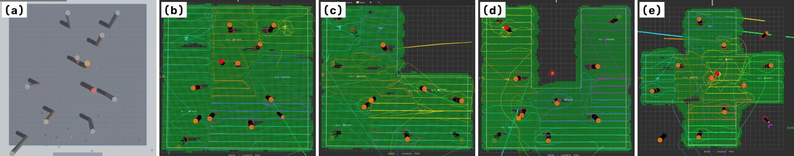
</p>
<p align="center"><sub><b>(a)</b> Gazebo, rectangular region. <b>(b)–(e)</b> Final RViz coverage maps (green) of the
PID-H∞ missions over the rectangle, L-, U- and plus-shaped regions.</sub></p>

This repository holds the simulation stack, the analysis scripts and the full paper:

> **I. A. Herdian, S. N. Affan, E. Ekawati**, "Fault-Tolerant Swarm Quadrotor Control for Non-Convex
> Geodetic Mapping," *5th Engineering Physics International Conference (EPIC 2026)*, Bandar Lampung,
> Indonesia, 24 October 2026. Full paper under review (AIP Conference Proceedings).
> [PDF](docs/Full%20Paper%20-%20EPIC/main.pdf)

**Highlights** (one run per configuration; see [Limitations](#limitations))

- **7 of 8 missions completed** with **96.9–99.0 % coverage** after losing 2 of 7 agents (28.6 % of the fleet).
- **PID-H∞ finished all four regions.** Where both controllers finished, it cut the RMS lateral sweep
  error by **16–31 %** and mission time by **11–15 %**, at **3.9–5.6×** the torque effort of PID-LQR.
- **Safety filter from the vehicle's real limits:** the CBF-QP's admissible approach speed is derived
  from the 15° tilt limit and the dead time, not tuned.
- **Failures reported, not hidden:** one PID-LQR mission was stopped after an agent struck a cylinder,
  and in three other missions an agent passed within rotor reach of one.

---

## Contents

- [Videos](#videos)
- [How it works](#how-it-works)
- [Scenario](#scenario)
- [Results](#results)
- [Limitations](#limitations)
- [Repository layout](#repository-layout)
- [Getting started](#getting-started)
- [Citation](#citation)
- [License](#license)

---

## Videos

Screen recordings of all eight missions (Gazebo left, RViz right), cropped and played **8× faster
than the recording**. Because Gazebo ran slower than real time while recording (real-time factor
0.09–0.13), 8× is roughly the speed of simulated time.

The text overlay is generated from the coordinator log: mission time, coverage, agents alive, kills
and the end of the mission.
Its times can differ by up to about a second from the controller logs used for many of the paper's
numbers; the mission time *T* in the results table is the "mission complete" moment shown in the clip.

Click a thumbnail to open the clip. The same missions are also on
[YouTube](https://youtube.com/playlist?list=PLfxyCAwHmhHI).

| Region | PID-H∞ | PID-LQR |
|---|---|---|
| **Rectangle** (784 m²) | [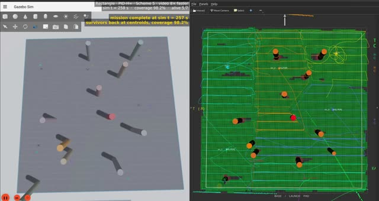](media/scheme5/rect_hinf.mp4) | [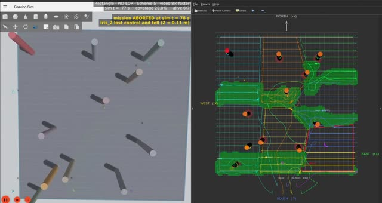](media/scheme5/rect_lqr.mp4)<br>aborted at 78.8 s (agent 2 struck a cylinder) |
| **L-shape** (588 m²) | [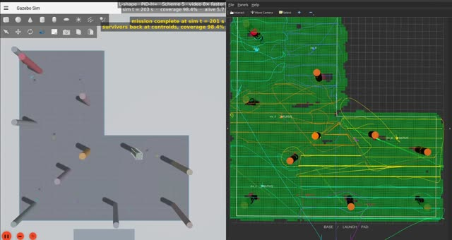](media/scheme5/l_shape_hinf.mp4) | [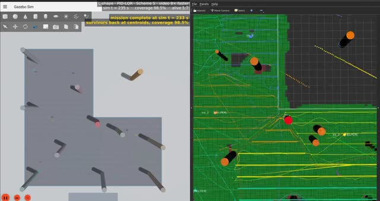](media/scheme5/l_shape_lqr.mp4) |
| **U-shape** (624 m²) | [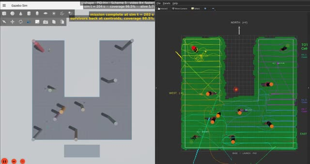](media/scheme5/u_shape_hinf.mp4) | [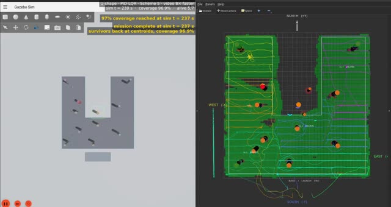](media/scheme5/u_shape_lqr.mp4) |
| **Plus** (460 m²) | [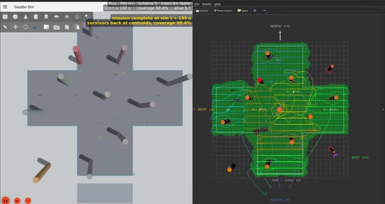](media/scheme5/plus_hinf.mp4) | [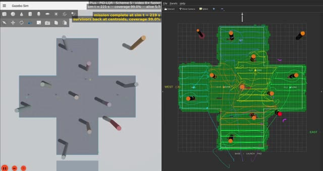](media/scheme5/plus_lqr.mp4) |

The clips are produced by [`swarm_ws/analysis/skema5_video_clips.py`](swarm_ws/analysis/skema5_video_clips.py);
[`media/scheme5/clips.json`](media/scheme5/clips.json) records the source recording, trim window,
recording real-time factor and file size of each clip.

---

## How it works

<p align="center">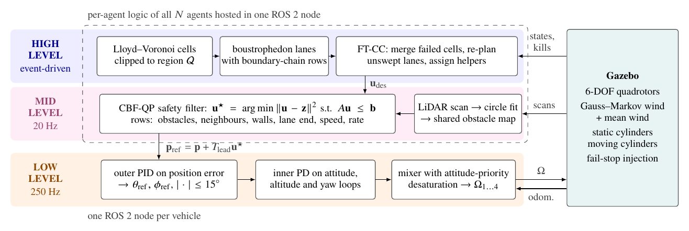</p>

Every agent runs the same three layers:

| Layer | Rate | What it does | Code |
|---|---|---|---|
| **High** | event-driven | Lloyd–Voronoi partition clipped to the (possibly non-convex) region, boustrophedon lanes whose first and last rows follow the cell boundary, and fault-tolerant cooperative coverage (FT-CC) that merges a failed agent's cell and hands its unswept lanes to neighbours | [`swarm_high_level`](swarm_ws/src/swarm_high_level) |
| **Mid** | 20 Hz | LiDAR scans → circle fits → one shared obstacle map; a CBF quadratic program filters every velocity command against obstacles, moving obstacles, neighbours, walls, lane end, speed and rate limits | [`swarm_mid_level`](swarm_ws/src/swarm_mid_level) |
| **Low** | 250 Hz | Cascaded PID (outer position loop, inner attitude PD, attitude-priority mixer) with gains synthesised from the LQR Riccati equation (ARE) or the H∞ Riccati equation (HARE, γ = 1.3 γ_min) | [`swarm_low_level`](swarm_ws/src/swarm_low_level) |

**Where the layers run.** In simulation, the high and mid layers of all seven agents are hosted in
one ROS 2 node, [`swarm_ws/nodes/swarm_mapping_coordinator.py`](swarm_ws/nodes/swarm_mapping_coordinator.py).
This node shares the coverage grid, obstacle map and failure notices without delay. Each vehicle
runs its own low-level node. Distributing the upper layers is future work.

### High level: partition, sweep, recover

<p align="center">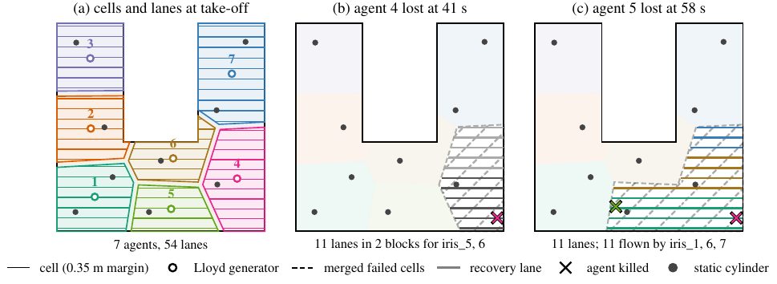</p>

U-shape, PID-H∞ mission, reproduced by the planner code (centroids within 0.6 cm of the log).
**(a)** Cells and lanes at take-off. **(b)** Agent 4 is lost at 41 s: its cell yields 11 lanes in
two blocks for helpers 5 and 6. **(c)** Helper 5 is lost too: the merged cells yield 11 lanes,
flown by agents 6, 1 and 7.

### Mid level: an actuator-consistent safety filter

<p align="center">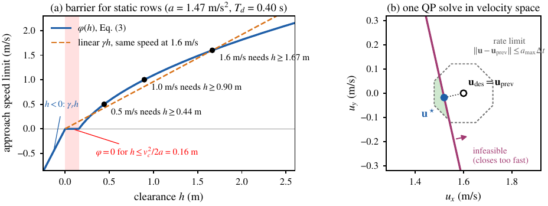</p>

**(a) The admissible approach speed φ(h).** This is the fastest approach at clearance *h* from
which the drone can still stop, given its tilt limit (a = 1.47 m/s²) and a lumped dead time of 0.40 s.

- φ is exactly zero within 0.16 m of the safety boundary.
- Sweeping at 1.6 m/s straight at a cylinder needs h ≥ 1.67 m.
- A linear class-K function γh would still allow approach where the vehicle can no longer stop.

**(b) One QP solve by the flight code.** The desired velocity (1.6, 0) m/s would close on a
cylinder too fast. The QP returns the nearest admissible velocity inside the rate limit: closing
speed 1.56 → 1.48 m/s. The solver is an exact 2-D active-set projection with no external QP library.

### One control tick

<p align="center">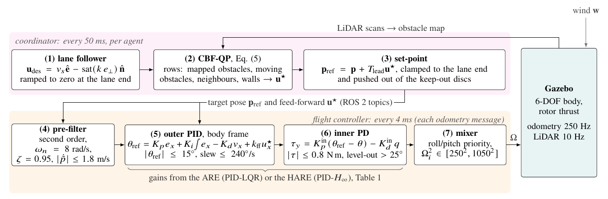</p>

---

## Scenario

All eight missions use the same combined-hazard scheme (`-s 5` in the launcher):

- **Vehicles.** Seven 3DR Iris quadrotors (m = 1.50 kg, arm 0.22 m) with ground-truth odometry (no
  state estimator). They cruise at 2.0 m and sweep at 1.6 m/s.
- **Regions.** Four regions inside a 28 × 28 m box: rectangle, L-shape, U-shape (10 m notch) and
  plus (10 m arms).
- **Static obstacles.** Nine vertical cylinders (r = 0.40 m) per region. None is known in advance:
  they are mapped by LiDAR in flight.
- **Moving obstacles.** Two kinematic cylinders (r = 0.45 m) oscillate along the diagonals at peak
  speeds of 1.6–2.5 m/s. Their positions come from simulator odometry.
- **Wind.**
  - Per horizontal axis: a first-order Gauss–Markov process (σ = 2.5 m/s, correlation time 0.5 s,
    seed 42), plus a −2 m/s mean from t = 5 s.
  - Recorded: mean (−2.34, −1.95) m/s, horizontal peaks 12.0 m/s.
- **Agent loss.** One pre-selected agent is killed (fail-stop) when coverage first reaches 18 %, and
  another at 32 %.
- **Shared by both controllers.** Planner, safety filter and plant model are identical; only the
  low-level gains differ.

---

## Results

### Mission metrics

| Region | Controller | Status | Coverage (%) | T (s) | Lateral RMS (cm) | Sweep speed (m/s) | Alt. RMS (cm) | Tilt p95 / max (°) | Torque effort (N²m²) | d_obs (m) | d_v2v (m) | QP tier 1–2 (%) |
|---|---|---|---|---|---|---|---|---|---|---|---|---|
| Rectangle | PID-H∞ | done | 98.2 | 257 | **7.2** | 1.20 | 2.5 | 14.7 / 21.1 | 0.054 | 0.49 | 1.71 | 2.9 |
| | PID-LQR | **aborted @ 78.8 s** | n/a | n/a | 11.7 | 1.12 | 7.3 | 14.7 / 155.9 | 0.024 | 0.06 | 1.52 | n/a |
| L-shape | PID-H∞ | done | 98.4 | **201** | **8.4** | 1.19 | 2.5 | 14.5 / 20.8 | 0.058 | 0.57 | 1.32 | 3.8 |
| | PID-LQR | done | 98.5 | 233 | 12.2 | 1.11 | 2.6 | 14.5 / 26.3 | 0.010 | 0.29 | 0.79 | 4.2 |
| U-shape | PID-H∞ | done | 98.5 | **202** | **8.3** | 1.21 | 2.6 | 14.8 / 20.7 | 0.044 | 0.63 | 1.77 | 4.1 |
| | PID-LQR | done | 96.9 | 237 | 11.4 | 1.07 | 2.5 | 14.2 / 16.6 | 0.011 | 0.42 | 1.73 | 4.1 |
| Plus | PID-H∞ | done | 98.4 | **195** | **9.7** | 1.15 | 5.4 | 14.7 / 82.5 | 0.053 | 0.24 | 1.24 | 4.1 |
| | PID-LQR | done | 99.0 | 219 | 11.5 | 1.02 | 2.6 | 14.4 / 40.1 | 0.014 | 0.24 | 1.12 | 4.9 |

**Column definitions.**
- *Sweep metrics:* lateral error, speed and tilt are taken during steady east–west sweeps.
- *Torque effort:* mean of τx² + τy².
- *d_obs:* minimum distance from the drone centre to a static cylinder's surface. The airframe
  reaches 0.235 m (body) and 0.348 m (rotor tips).
- *d_v2v:* minimum distance between agents; the hard limit is 0.70 m.
- *Killed agents:* rectangle 4, 7 (H∞) and 7 (LQR, second kill never reached); L-shape 4, 7;
  U-shape 4, 5; plus 1, 7.

### Trajectories and coverage

<p align="center">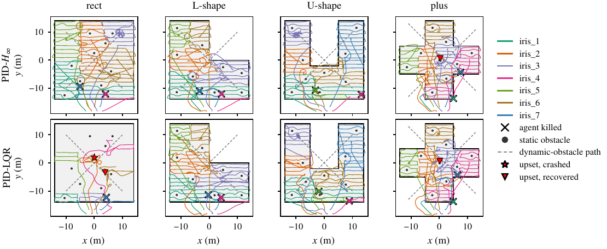</p>
<p align="center">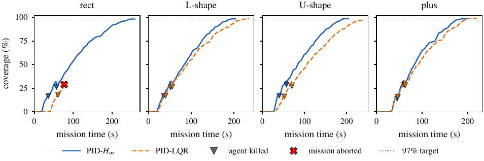</p>

**Coverage after a kill.** Each kill causes a small drop, because the failed cell's coverage is
erased; the slope then resumes as helpers take over the lanes.

**Obstacle maps.** Every obstacle map held all nine cylinders. No completed mission needed tier 3
of the QP infeasibility ladder.

### Tracking under turbulence: LQR vs H∞ gains

<p align="center">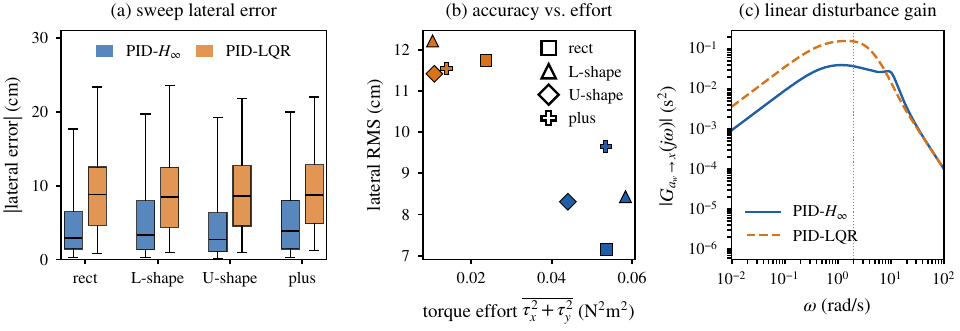</p>

**Lateral error is mostly a mean offset.**
- PID-LQR flew −5.7 to −7.0 cm downwind of the lane; PID-H∞ flew within 0.7–1.6 cm.
- The PID-LQR node freezes its position integrator whenever the error exceeds 0.25 m. This happened
  in 36–45 % of its sweep samples. The H∞ outer integral gain is also 3.9× larger.

**Faster sweeps.** Mean sweep speeds of 1.15–1.21 m/s against 1.02–1.12 m/s contribute to the 11–15 %
shorter missions.

**The price.** The H∞ gains used 3.9–5.6× the torque effort, with motor saturation below 0.2 % of
samples.

**Linear analysis of the outer loop.**

| Design | Kp | Ki | Kd | ‖G‖∞ disturbance → position (s²) | Phase margin | Gain margin |
|---|---|---|---|---|---|---|
| PID-LQR | 0.757 | 0.283 | 0.394 | 0.158 | 37.4° | 11.5 dB |
| PID-H∞ | 2.705 | 1.092 | 1.107 | **0.040** (4.0× lower) | 25.2° | 9.0 dB |

**What the comparison can and cannot show.** The two designs also differ in their Q/R weights and in
the integrator gating. This comparison is therefore between two complete gain designs; it does not
isolate the effect of γ.

### Safety: contacts and upsets

<p align="center">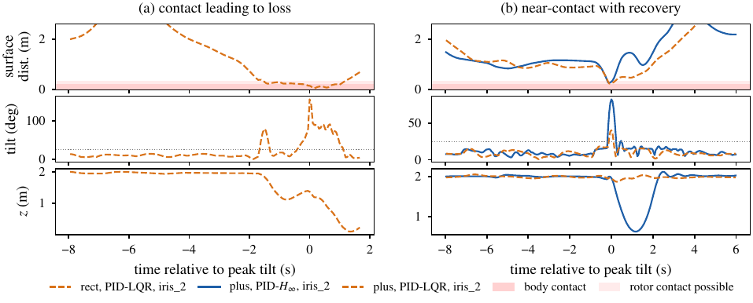</p>

**Rectangle, PID-LQR: crash.** Agent 2 came within 0.06 m of the cylinder at (0, 2.5), which is body
contact. It tilted to 155.9° and fell, and by protocol the run was stopped.

**Plus, both controllers: grazes.** Agent 2 grazed the central cylinder in both missions.
- PID-LQR: tilted to 40.1°.
- PID-H∞: tilted to 82.5°, dropped to 0.64 m, and recovered within about 3 s.

**Common pattern.** Every upset happened while an agent stepped to its next lane beside a cylinder,
after 1–4 s of tier-2 QP solves bound by that cylinder. With one run per case these events
cannot be attributed to the controller. Plausible contributors:
- obstacle-blind lane ends inside a cylinder's margin;
- a barrier built on a 0.22 m disc;
- a fixed 0.5 m/s² wind allowance that ignores gusts.

---

## Limitations

The results rest on:
- single runs (one wind seed);
- perfect state and moving-obstacle feedback;
- instant failure detection;
- geometric coverage;
- centralised upper layers;
- no ablation or re-implemented baseline.

The paper assumes a light rotor guard when interpreting grazing contacts. The guard is not
simulated and changes no reported number.

The raw telemetry (controller CSVs and coordinator logs, about 200 MB) is **not** included in this
repository. The analysis scripts show exactly how every number and figure was computed from it.

---

## Repository layout

```
swarm_ws/                         colcon workspace (ROS 2)
├── launch_mapping_demo.sh        one-command launcher: Gazebo + RViz + 7 drones + coordinator
├── nodes/
│   └── swarm_mapping_coordinator.py   high + mid level for all agents (mission state machine)
├── src/
│   ├── swarm_high_level/         region polygons, Voronoi / boustrophedon geometry, metrics (pure Python)
│   ├── swarm_mid_level/          CBF-QP safety filter + LiDAR obstacle map (pure numpy)
│   ├── swarm_low_level/          PID-LQR / PID-H∞ controller nodes, gain synthesis, wind node
│   └── swarm_sim/                Gazebo worlds, iris models, RViz config, launch files
├── analysis/                     paper numbers, figures and video clips
│   ├── skema5_paper_analysis.py  every number in the paper (tables, macros, audit)
│   ├── concept_figures.py        Fig. 2–3 from the real planner / QP code
│   ├── skema5_video_frames.py    frames for Fig. 7
│   └── skema5_video_clips.py     the clips in media/scheme5
├── tools/                        batch runners, world generators, kill_drone.sh
└── tests/                        integration scripts
docs/Full Paper - EPIC/           LaTeX source and PDFs of the paper (main.pdf, main_anon.pdf)
media/                            README figures and mission clips
matlab_reference/                 MATLAB/Simulink reference models for the PID-LQR and PID-H∞ synthesis
```

---

## Getting started

**Requirements.**
- Ubuntu with ROS 2 **lyrical** and Gazebo (gz-sim 10).
- Python 3.14 with the packages in [`requirements.txt`](requirements.txt), in a `.venv` at the
  repository root. The launch scripts source it automatically.

```bash
git clone https://github.com/izmaherdian/swarm-quadrotor-mapping.git
cd swarm-quadrotor-mapping
python3 -m venv .venv && .venv/bin/python -m pip install -r requirements.txt

source /opt/ros/lyrical/setup.bash
cd swarm_ws
colcon build
source install/setup.bash
```

**Run a mission.** For example, the U-shape PID-H∞ mission from the paper:

```bash
./launch_mapping_demo.sh -s 5 --pid-hinf --region u_shape \
    --victim1 4 --victim2 5 --results my_run --exit-after 3.0
```

**Launcher options.**

| Option | Values |
|---|---|
| `-s` (scheme) | `1` nominal, `2` wind, `3` static obstacles, `4` static + moving obstacles, `5` all hazards + two scheduled agent kills |
| Controller | `--pid-lqr` or `--pid-hinf` |
| `--region` | `rect`, `l_shape`, `u_shape`, `plus`, or a YAML polygon |
| `--headless` | runs without GUI |
| `--exit-after N` | shuts the coordinator down N seconds after every surviving agent is done |

To kill an agent by hand from a second terminal: `./kill_drone.sh 4`.

**Unit tests.** The geometry and CBF libraries need neither ROS nor Gazebo:

```bash
cd swarm_ws
PYTHONPATH=src/swarm_high_level:src/swarm_mid_level:src/swarm_low_level \
  pytest src/swarm_high_level/test src/swarm_mid_level/test -q
```

---

## Citation

```bibtex
@inproceedings{herdian2026faulttolerant,
  author    = {Herdian, Izma Alhazmi and Affan, Sulthan Naufal and Ekawati, Estiyanti},
  title     = {Fault-Tolerant Swarm Quadrotor Control for Non-Convex Geodetic Mapping},
  booktitle = {5th Engineering Physics International Conference (EPIC 2026)},
  address   = {Bandar Lampung, Indonesia},
  year      = {2026},
  note      = {Full paper under review}
}
```

## Authors

- **Izma Alhazmi Herdian**<sup>1,2</sup>: izmaherdian@gmail.com
- **Sulthan Naufal Affan**<sup>1</sup>
- **Estiyanti Ekawati**<sup>1,2</sup>

<sup>1</sup> Engineering Physics Department, Institut Teknologi Bandung.
<sup>2</sup> Center for Instrumentation Technology and Automation (CITA), Institut Teknologi Bandung.

The authors thank CITA, ITB, for covering the conference registration and publication fees of the paper.

## License

| What | License |
|---|---|
| Source code and everything not listed below | [MIT](LICENSE) |
| Figures, video clips and thumbnails in [`media/`](media) | [CC BY 4.0](media/LICENSE) |
| Paper and abstract (`docs/Full Paper - EPIC/`, `docs/Abstract - EPIC/`, `docs/Progress/`: text, PDFs and Word files) | All rights reserved by the authors; copyright may pass to the publisher on publication |
| `EPIC2026_Author_Guidelines.pdf`, `AIPCP_Article_Template_Sept1_2023.*` | Property of EPIC 2026 and AIP Publishing; included for reference only |
| `docs/Full Paper - EPIC/aipnum4-1-epic.bst` | Modified from `aipnum4-1.bst` (REVTeX 4.1), LaTeX Project Public License |
